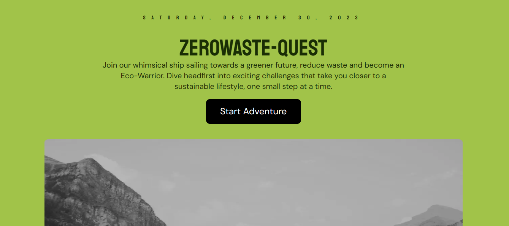

# ZeroWaste-Quest
A waste reduction challenge hub

This is a community-driven platform dedicated to waste reduction and sustainable living. This project aims to inspire individuals to take meaningful actions towards reducing their environmental impact through engaging challenges and a supportive community.

## Project overview
It empowers users to participate in waste reduction challenges, set personal goals, track progress, and connect with a like-minded community. By fostering a sense of collective responsibility, the platform strives to make a positive impact on the environment.

## Features

- User Registeration and onboarding
- Explore challenges
- Join challenges
- Set and track individual waste reduction goals
- Progress tracking (log daily progress, share achievements)
- Community interaction (This is optional but its still a feature that could be added to the prototype)
- Achievements and rewards (virtual badges and redeemable points)
- Educational resources (optional)

**challenge parameters**
These are the parameters for waste reduction challenges
- Duration for completing the challenge. It would be a week-long

**Waste reduction Challenges users can participate in**
- Plastic-Free week challenge
- Zero-Waste Kitchen Challenge
- Digital Detox challenge
- Green commuting challenge
- Energy-saving challenge
- Local produce challenge

## Workflow

1. User Registration:
   - Fullname - Email Address - Username - Password - Location - Profile Picture - Personal Interests
   -
2. Explore Challenges - Users will browse existing waste reduction challenges or create their own.
3. Join Challenges - Users will select and join challenges **based on their interests**.
4. Set Personal Goals - Users will set individual waste reduction goals within the challenge parameters.
5. Progress Logging - Participants log their progress regularly through the platform.
   **NOTE** - Challenges will expire one week after application
- **Daily log feature**
This feature will enable participants to log their daily progress. For example, participants can input information about their waste reduction activities, such as reducing plastic usage, composting, or using sustainable transportation.
- **Media Upload Capability**
An option for participants to upload photos or short videos showcasing their waste reduction efforts. This adds a visual component to their progress.
<!-- 6. Community Interaction: Users can engage with the community, share experiences, and seek advice. (Optional) -->
7. Achievements and Rewards - Users can receive virtual badges or points for reaching milestones.
<!-- 8. Educational Resources - Users access educational resources and tips for sustainable living. (Optional) -->

## Tools and Technologies
- Nextjs, Typescript, Firebase, shadcn, cloudinary
